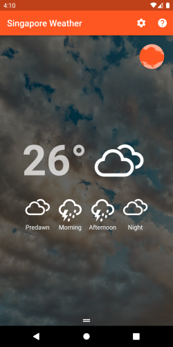
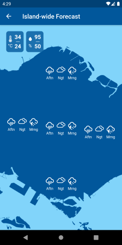

# Singapore Weather

This app shows the weather at your current location. *Works in Singapore only*.





## Requirements

Runs on Android 11 or newer.

Requires location and internet access.

## Build

Use the latest [Flutter SDK](https://flutter.dev/docs/get-started/install).

It is strongly recommended to use [Visual Studio Code](https://code.visualstudio.com/) with the Dart, Flutter, and Flutter Intl extensions. Check out this [guide](https://flutter.dev/docs/development/tools/vs-code).

If debugging or building for the first time, some additional source files have to generated first. Run the command:
```
flutter pub run build_runner build
```

> ## How to use
>
> - Drag downwards to refresh data.
>
> - Drag upwards from bottom third of the screen to reveal weather details.

## Acknowledgement

[Data.gov.sg](https://data.gov.sg/) datasets licensed under [Singapore Open Data License](https://data.gov.sg/open-data-licence). Access via API is subject to [API Terms of Service](https://data.gov.sg/privacy-and-website-terms#api-terms).

[Weather Icons](https://erikflowers.github.io/weather-icons/) licensed under [SIL OFL 1.1](http://scripts.sil.org/OFL).

[Unsplash](https://unsplash.com) photos licensed under [Unsplash License](https://unsplash.com/license) from contributors: [Christina Victoria Craft](https://unsplash.com/s/photos/wind?utm_source=unsplash&utm_medium=referral&utm_content=creditCopyText), [David Moum](https://unsplash.com/@davidmoum?utm_source=unsplash&utm_medium=referral&utm_content=creditCopyText), [Eric Muhr](https://unsplash.com/@ericmuhr?utm_source=unsplash&utm_medium=referral&utm_content=creditCopyText), [Fabio Neo Amato](https://unsplash.com/@cloudsdealer?utm_source=unsplash&utm_medium=referral&utm_content=creditCopyText), [Guillaume M.](https://unsplash.com/@guimgn?utm_source=unsplash&utm_medium=referral&utm_content=creditCopyText), [Jason Briscoe](https://unsplash.com/@jsnbrsc?utm_source=unsplash&utm_medium=referral&utm_content=creditCopyText), [Peyman Farmani](https://unsplash.com/@peymanfarmani?utm_source=unsplash&utm_medium=referral&utm_content=creditCopyText).

Developed using [Flutter](https://flutter.dev) including third-party libraries: [build_runner](https://pub.dev/packages/build_runner), [expandable_bottom_sheet](https://pub.dev/packages/expandable_bottom_sheet), [flutter_markdown](https://pub.dev/packages/flutter_markdown), [http](https://pub.dev/packages/http), [intl](https://pub.dev/packages/intl), [json_annotation](https://pub.dev/packages/json_annotation), [json_serializatble](https://pub.dev/packages/json_serializable), [location](https://pub.dev/packages/location), [mockito](https://pub.dev/packages/mockito), [package_info](https://pub.dev/packages/package_info), [provider](https://pub.dev/packages/provider), [url_launcher](https://pub.dev/packages/url_launcher), [weather_icons](https://pub.dev/packages/weather_icons).

## Privacy policy

This app itself *does not* collect or store any private data.

The app uses [Data.gov.sg](https://data.gov.sg/) (see relevant [Privacy Statement](https://data.gov.sg/privacy-and-website-terms#privacy)).

## License

Source code is available on [GitHub](https://github.com/hum-ler/singapore_weather) under [The MIT License](https://opensource.org/licenses/MIT).
